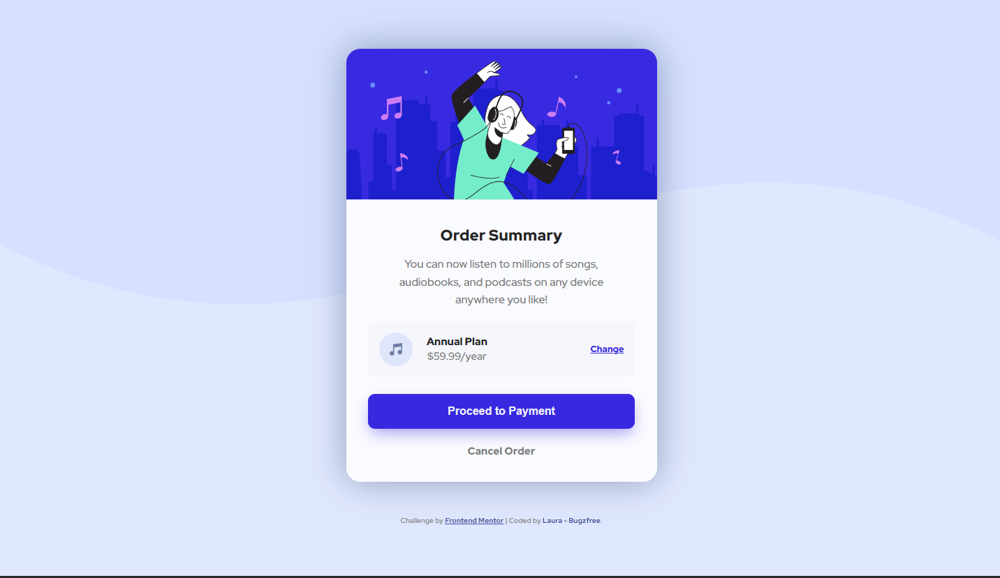
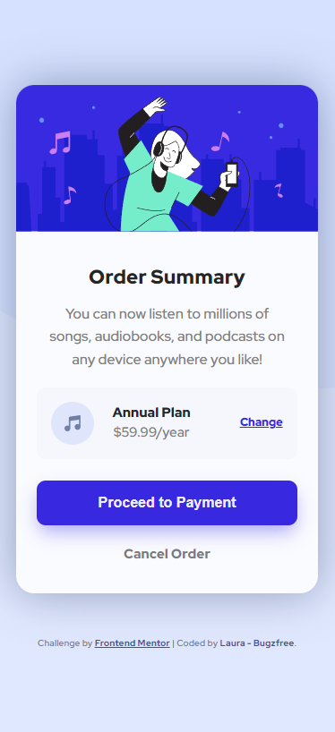

# Frontend Mentor - Order summary card solution

## Table of contents

- [Overview](#overview)
  - [Screenshot](#screenshot)
  - [Links](#links)
- [My process](#my-process)
  - [Built with](#built-with)
  - [What I learned](#what-i-learned)
  - [Continued development](#continued-development)
  - [Useful resources](#useful-resources)
- [Author](#author)
- [Acknowledgments](#acknowledgments)

## Overview

### Screenshot

### Links

- Solution URL: [My solution](https://github.com/Laura-BugFree/order-summary-component.git)
- Live Site URL: [live site]( https://laura-bugfree.github.io/order-summary-component/)

## My process

### Built with

- Flexbox
- Mobile-first workflow

### What I learned

*Responsiveness – I am learning to do mobile-first workflow as I am finding it easier when dealing with responsiveness, which I have struggled with in the past. 
*Flexbox – I am using this as a good time to re-enforce the things I have learnt about flex box. 
*SVG – I have never worked with svg images in css and this served as a good exercise to learn that. 

### Continued development

I am still working on naming classes. Would like to get more into custom, variables. I am still very new to this all so I have a lot to learn.

### Useful resources

- [Kevin Powell's SVG videos](https://www.youtube.com/watch?v=ZJSCl6XEdP8) - Just to understand the very basic, he is a brilliant teacher and I am using a lot of his video's and courses through my development journey
- [Artical on using SVG as background images](https://www.svgbackgrounds.com/how-to-add-svgs-with-css-background-image/) - This artical was instrumental in helping me use SVG images as background images.

## Author

- Website - Working on it!
- Frontend Mentor - [@Laura-Bugfree](https://www.frontendmentor.io/profile/Laura-Bugfree)

## Acknowledgments

My Husband, he is the one who suggested this as a path for me to persue and he has helped me understand a great deal.
